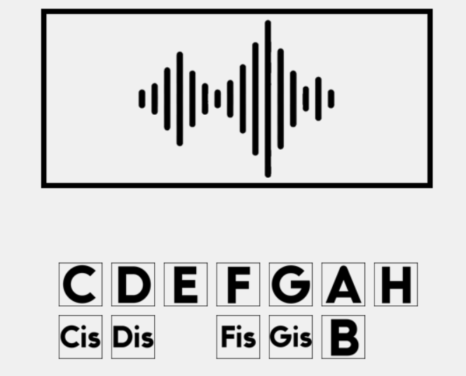
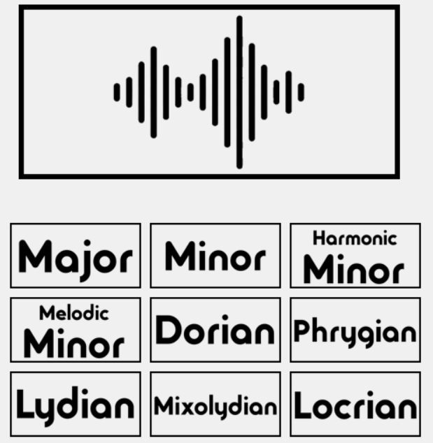
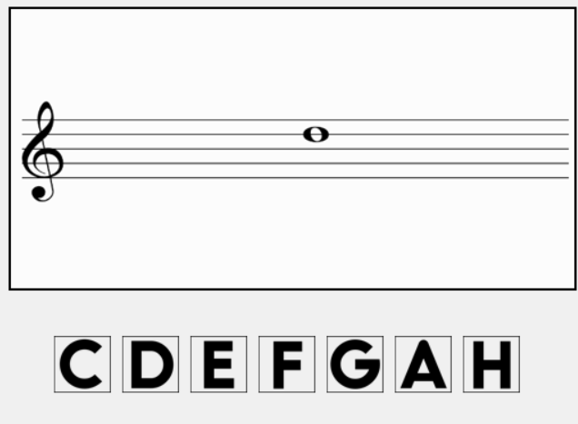
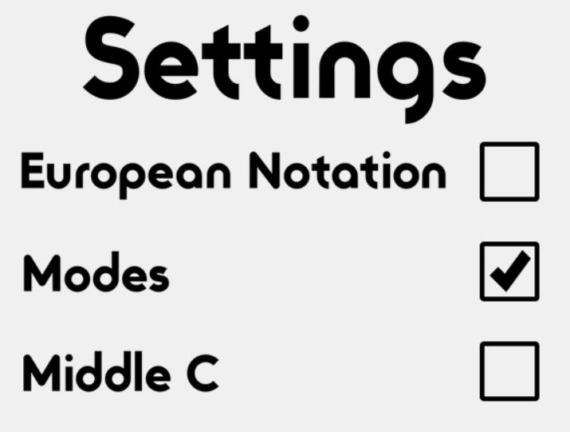
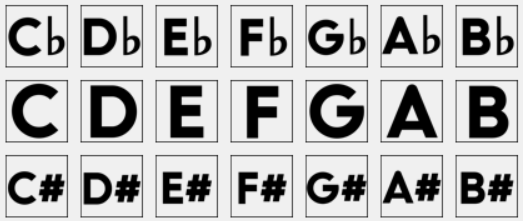
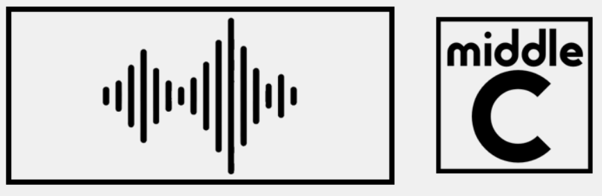

#Theorite
## by Deniel Stájner
### school project for the Secondary Technical School of Electrical Engineering Jecna

Theorite is an app where you can practice everyday music theory skills.
From notation reading to ear training.

###Theorite has 8 exercises one can take
###Note identification by ear

###Interval identification by ear

###Scale identification by ear

###Chord identification by ear

###Note identification as notated

###Interval identification as notated

###Key signature identification

###Chord identification as notated

## The user is able to configure his preferences in the settings menu

###European Notation toggles between the European and Standard notation in exercises that include notes

####Becomes

###With modes disabled, in the key signature section the user will only encounter major and minor
###With modes enabled, the user will also sometimes be asked to identify the key signature in a different mode

###The Middle C setting will enable a button that plays a C4 note

##

###Fullscreen setting toggles between 960x540 and fullscreen resolutions
radek je pero